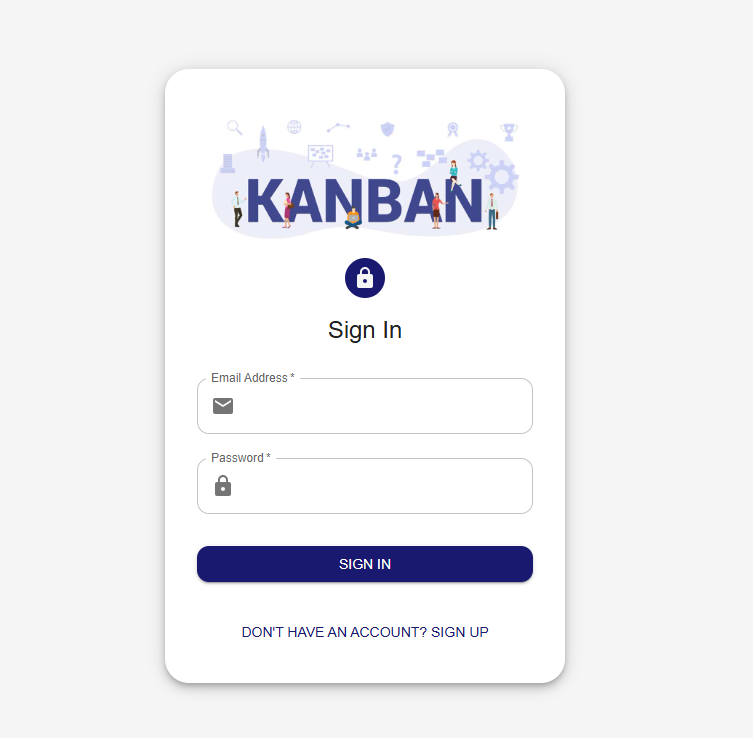
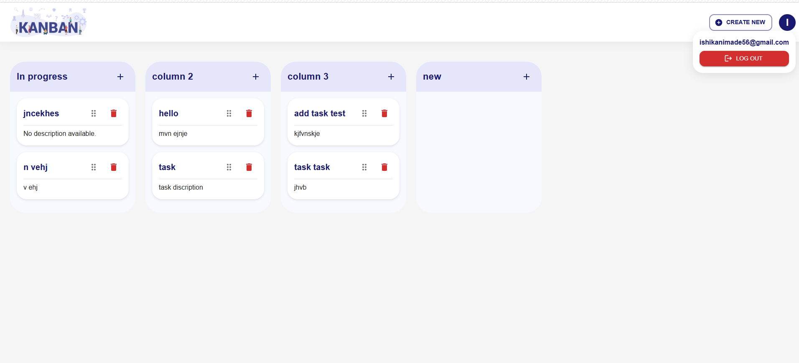
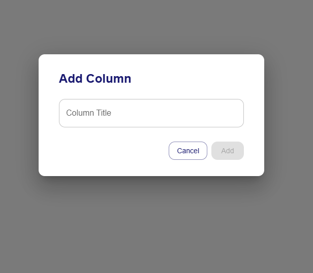
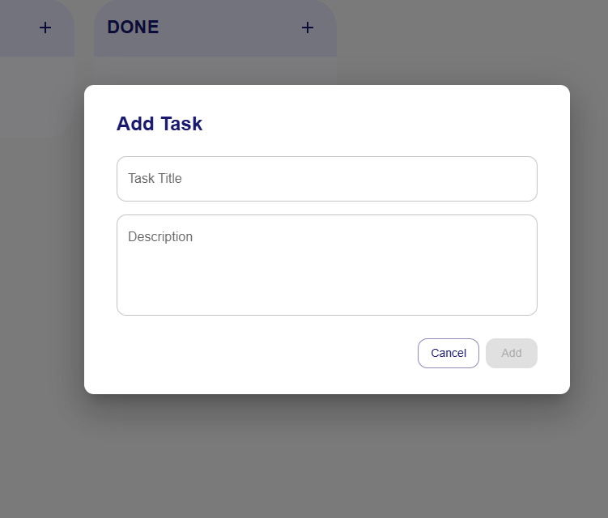

# Kanban Board - Full Stack Project

## 🚀 Objective

Build a modern and functional **Kanban Board** to demonstrate full-stack development skills, with a strong emphasis on:

- RESTful API Design (Node.js + Express)
- MongoDB integration
- JWT-based authentication
- A clean, modern React UI (TypeScript + MUI)
- Drag and Drop Task management

---

## 🧰 Tech Stack

### 💻 Frontend
- **React (TypeScript)**
- **Material UI (MUI)**
- **Dnd-kit** (for drag-and-drop functionality)
- **Context API** (state management)
- **Axios** (API communication)
- **React Router DOM**

### 🔧 Backend
- **Node.js**
- **Express.js**
- **MongoDB + Mongoose**
- **JWT + bcrypt.js** (auth)
- **dotenv** (env config)
- **CORS**

---

## ✨ Features

### 🔐 User Authentication
- Register & login with email/password
- JWT token-based protected routes

### 🗂️ Kanban Board
- One board per user
- Multiple columns
- Multiple tasks under each column
- Drag & drop tasks between columns

## 🖼️ Screenshots

### 🔐 Login Page / Signup Page



### 📋 Kanban Board with Tasks & Columns


### ➕ Add Column


### ➕ Add Task


### ✏️ Delete Task


> 🔎 _All screenshots are from the live running app._


### 🔁 REST APIs

| Method | Endpoint             | Description                                 |
|--------|----------------------|---------------------------------------------|
| POST   | `/signup`            | Register new user                           |
| POST   | `/login`             | Login user and return JWT token             |
| GET    | `/board`             | Fetch the board with all columns and tasks  |
| POST   | `/board/column`      | Add a new column                            |
| POST   | `/board/task`        | Add a task to a column                      |
| PATCH  | `/board/task/:id`    | Update task or move it to another column    |
| DELETE | `/board/task/:id`    | Delete task                                 |

---

## 🗃️ Directory Structure

### 📦 Backend
```
backend/
│
├── src/
│   ├── config/           # MongoDB connection & global config
│   ├── controllers/      # Auth and Board logic
│   ├── middleware/       # Auth middleware
│   ├── models/           # Mongoose models 
│   ├── routes/           # Express routers
│   ├── utils/            # Helper functions 
│   ├── app.js            # Express app setup
│   └── server.js         # Entry point
├── .env                  # Environment variables
├── package.json
```

### 🎨 Frontend
```
frontend/
│
├── src/
│   ├── api/              # Axios setup
│   ├── assets/           # Images, icons, etc.
│   ├── components/       # Reusable UI components 
│   ├── context/          # Global state 
│   ├── hooks/            # Custom hooks 
│   ├── layouts/          # Layout wrappers
│   ├── pages/            # Page components 
│   ├── routes/           # React Router routes
│   ├── services/         # API service functions
│   ├── styles/           # Theme and custom styling
│   ├── types/            # TypeScript types & interfaces
│   ├── App.tsx           # Root component
│   └── index.tsx         # Entry point
├── package.json
```

---

## ⚙️ Setup Instructions

### ✅ Prerequisites

- [Node.js](https://nodejs.org/)
- [MongoDB](https://www.mongodb.com/) (Local or Atlas)
- [npm](https://www.npmjs.com/) or [yarn](https://yarnpkg.com/)

---

### 🔌 Backend Setup

```bash
cd backend
npm install
```

#### 🌐 Create `.env` file:
```
PORT=5000
MONGO_URI=your_mongodb_connection_string
JWT_SECRET=your_super_secret_key
```

#### ▶️ Start the backend server
```bash
npm run dev
```

---

### 🎨 Frontend Setup

```bash
cd frontend
npm install
npm start
```

App will run at: `http://localhost:3000`

---

## 🧪 API Testing

You can use **Postman**, **Thunder Client**, or the **frontend UI** to test the app:

- `POST /signup` – Register
- `POST /login` – Authenticate
- `GET /board` – View board
- Add/Update/Delete columns and tasks via UI or API calls
